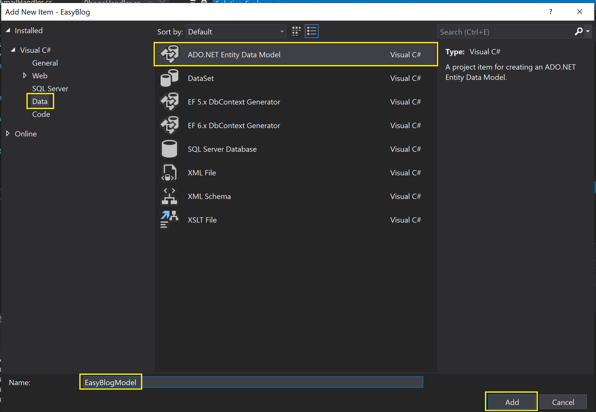
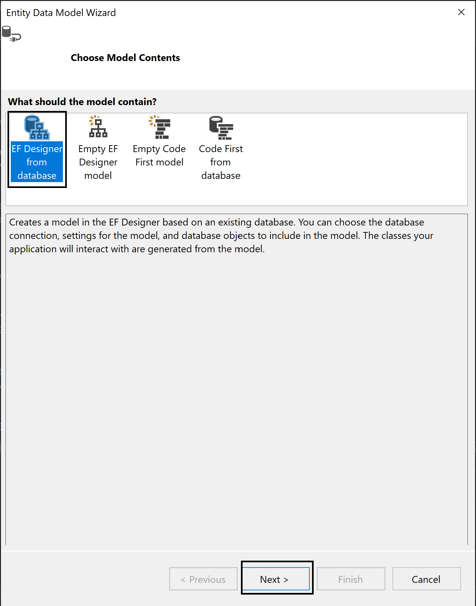
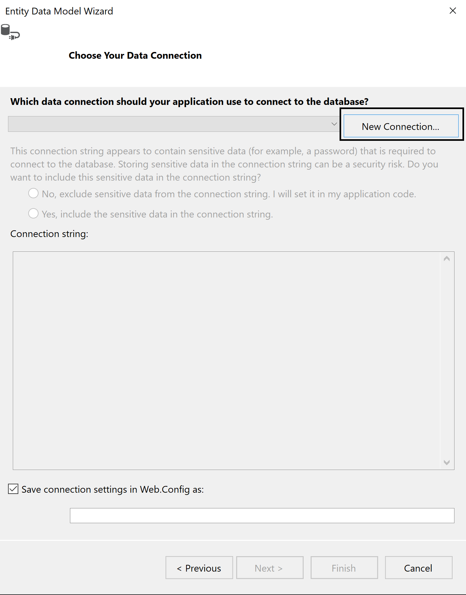
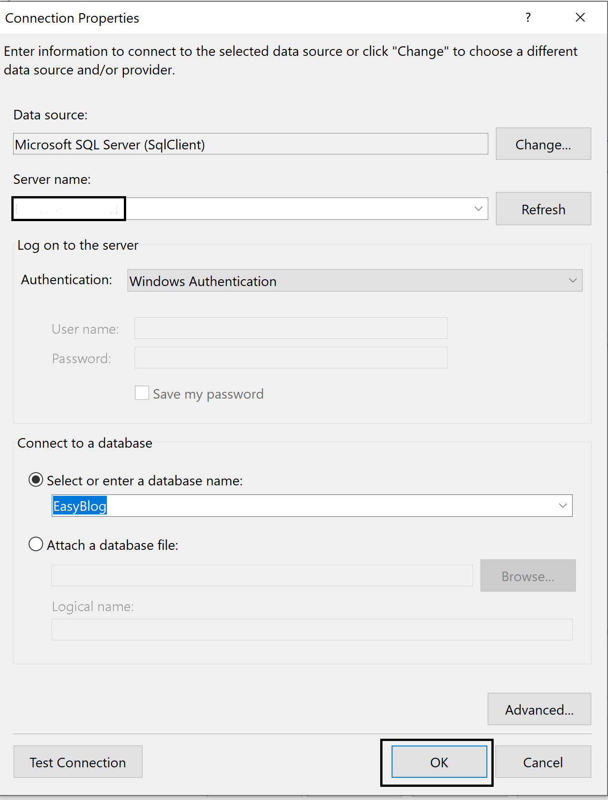
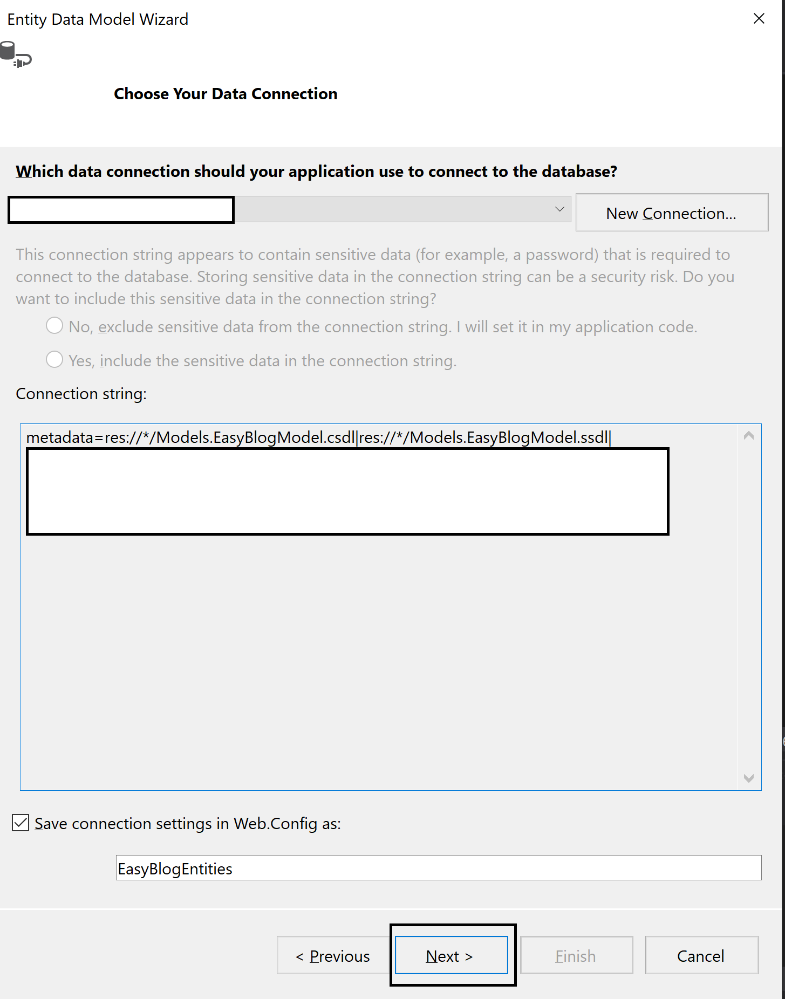
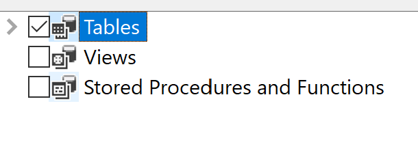

# Easy-Blog

## Description

This project aim is to enabling users to make their own blogs without writing code.
In the project I used three Bootstrap ready made blog templates. Users can redesign 
them according to their needs. Also, they can update their blog whenever they want.

## Technologies

- C# Programing Language
- JavaScript
- HTML and CSS
- Visual Studio
- Microsoft SQL Server
- Entity Framework
- Twilio

## Run
1) Execute the script inside the Database folder.
2) After executing scripts follow the bellow steps.
* Right click Models folder in Visual Studio and click Add then New Item.
* Add ADO.NET Entity Data Model. 
    * 
* Pick EF Designer from database.    
    * 
* New connection.   
    * 
* Pick or enter the server name and pick EasyBlog database.    
    * 
* Click next and continue.    
    * 
* Pick all tables and finish.
    * 
3) In order to use SMPTClient and Twilio SMS API you need to create 'PrivateSettings.config' inside the Easy-Blog folder and add the below code with necessary information.
```
   <appSettings>
      <add key="SenderEmail" value="<YourEmailAddress>"/>
      <add key="SenderPassword" value="<EmailAddressPassword>"/>
      <add key="AccountSid" value="<TwilioAccountSid>"/>
      <add key="AuthToken" value="<TwilioAuthToken>"/>
      <add key="Phone" value="<TwilioPhoneNumber>"/>
   </appSettings>
```


